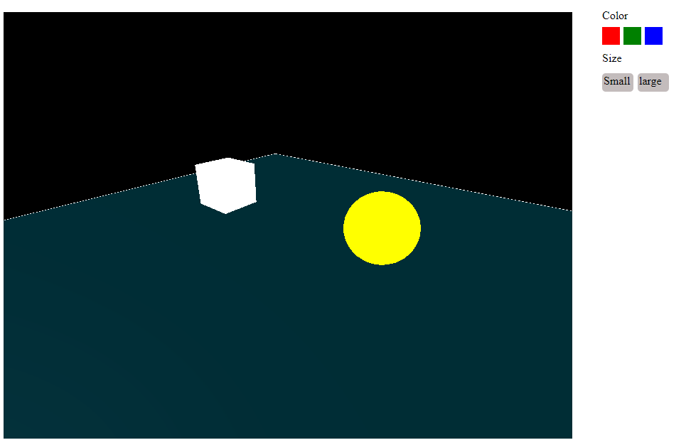

# Basic interaction with mesh in 3.js scene

## Setup
Download [Node.js](https://nodejs.org/en/download/).
Run this followed commands:

``` bash
# Install dependencies (only the first time)
npm install

# Run the local server at localhost:8080
npm run dev

# Build for production in the dist/ directory
npm run build
```
## Functionalities

```bash
# Orbit Control
Press left click of the mouse and move anround, the orbit of the camera (view of the 3D scene) can be changed.

# Drag & Drop
Clicking the mesh in the scene, it can be dragged and dropped in different position in the scene.

#Color change
Click the mesh then click the color palette, and the color of the mesh can be changed.

# Size change
Click the mesh then click the size choice, and the size of the mesh can be changed.
```
## Images
